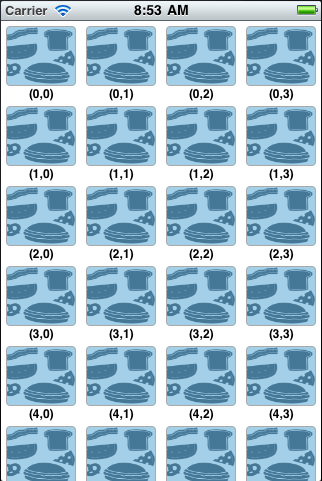

UIGridView (iOS = iPhone/iPad)
========================

UIGridView offers a simple way to build a grid (multiple-column UITableView).

It supports:

* Adjust the width of a column (individually)
* Adjust the height of a row (individually)
* Click event on a cell
* Customize cell

Here is how it looks like:




How to use it
------------------------
1. Include /Classes/UIGridView/* into your project
2. Setup the delegate ```uiGridViewDelegate``` of UIGridView; Methods that shall be implemented are shown below:

```objc
- (CGFloat) gridView:(UIGridView *)grid widthForColumnAt:(int)columnIndex
{
	return 80;
}

- (CGFloat) gridView:(UIGridView *)grid heightForRowAt:(int)rowIndex
{
	return 80;
}

- (NSInteger) numberOfColumnsOfGridView:(UIGridView *) grid
{
	return 4;
}


- (NSInteger) numberOfCellsOfGridView:(UIGridView *) grid
{
	return 33;
}

- (UIGridViewCell *) gridView:(UIGridView *)grid cellForRowAt:(int)rowIndex AndColumnAt:(int)columnIndex
{
	Cell *cell = (Cell *)[grid dequeueReusableCell];
	
	if (cell == nil) {
		cell = [[Cell alloc] init];
	}
	
	cell.label.text = [NSString stringWithFormat:@"(%d,%d)", rowIndex, columnIndex];
	
	return cell;
}

- (void) gridView:(UIGridView *)grid didSelectRowAt:(int)rowIndex AndColumnAt:(int)colIndex
{
	NSLog(@"%d, %d clicked", rowIndex, colIndex);
}
```

Author
------------------------
Tanin Na Nakorn

License
------------------------
This project is under Tanin License, which means:

1. You can use it under a free/commercial/whatever project
2. You can do whatever you want with it
3. You can steal it and declare that you build it.

There is no need to give the owner credit.
